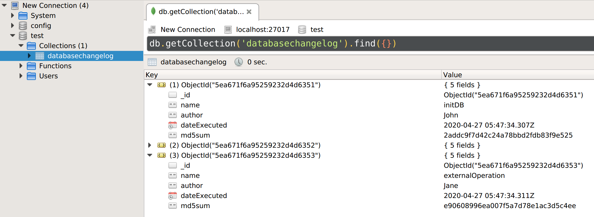

# Node MongoDB Changelog

Liquibase inspired MongoDB migration tool for Node.js.

## Install

```npm i --save https://github.com/hendrik-scholz/node-mongodb-changelog/#master```

## Usage

```javascript
const changelog = require('mongodb-changelog');

const config = {mongoUrl: 'mongodb://localhost:27017', databaseName: 'test', mongoConnectionConfig: {}};
const tasks = [
    {name: 'initDB',           author: 'John', operation: () => Promise.resolve(true)},
    {name: 'addAppAdminUsers', author: 'Jane', operation: () => Promise.resolve(true)},
];

changelog(config, tasks).then(
    res => console.log(res),
    err => console.error(err.message)
);
```

The code above will create a collection called "databasechangelog" with two records inside (one per each task).
Each record contains the name of the task, the author, the date of applying, and the md5sum of the function.

Check out tests for more examples.

## Features

* changeset functions synchronous processing
* changeset modifications monitoring
* migrations automatic run
* async/await support



## Test

If you have trouble running the test, enable debugging for the MongoMemoryServer to find out more about the
reason. To enable debugging set the debug flag for the MongoMemoryServer config in the  package.json to "1". 
On ubuntu 18.04 for example the package "libcurl4" has to be installed in order to get the MongoMemoryServer started.

## References

http://mongodb.github.io/node-mongodb-native/3.5/api/

https://github.com/nodkz/mongodb-memory-server
